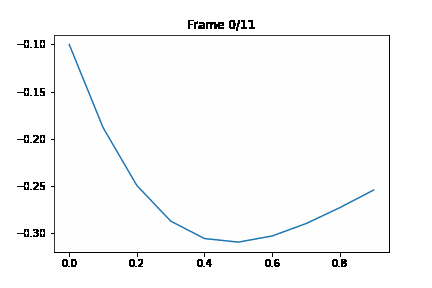
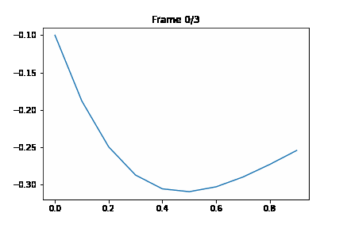

# OptiNumPy - Numerical Analysis Optimization Package

[](LICENSE)

## Overview

Welcome to the OptiNumPy - Numerical Analysis Optimization Package! This library is designed to provide various numerical optimization algorithms for solving optimization problems. The package is divided into three modules:

- [univariate_optimization.py](https://github.com/NechbaMohammed/OptiNumPy/blob/main/OptiNumPy/univariate_optimization.py) 
- [equation_solving.py](https://github.com/NechbaMohammed/OptiNumPy/blob/main/OptiNumPy/equation_solving.py)
- [multivariate_optimization.py](https://github.com/NechbaMohammed/OptiNumPy/blob/main/OptiNumPy/multivariate_optimization.py)


## Features

### I. Univariate Optimization Algorithms:

- **Searching with Elimination Methods**:
  - Unrestricted Search: A method to find the minimum of a function within a given interval without any assumptions about the function's properties.
  - Exhaustive Search: An exhaustive method that evaluates the function at multiple points within the search interval to find the minimum.
  - Dichotomous Search: A method that repeatedly reduces the search interval by half to narrow down the minimum.
  - Interval Halving Method: An iterative method to find the minimum by reducing the search interval based on function evaluations.
  - Fibonacci Method: A method that narrows down the minimum by using the Fibonacci sequence to update the search interval.
  - Golden Section Method: An optimization method that efficiently narrows down the minimum using the golden ratio.

- **Searching with Interpolation Methods**:
  - Newton-Raphson Method: An iterative method that uses linear interpolation to find the minimum of a function.
  - Quasi-Newton Method: An iterative method that approximates the Hessian matrix to find the minimum.
  - Secant Method: A root-finding method that iteratively approximates the derivative to find the minimum.

### II. Equation Solving & Decompositions:

- **The Elimination Of Gauss-Jordan**: A method to solve systems of linear equations using the Gauss-Jordan elimination technique.
- **LU Decomposition Method**: A method to decompose a square matrix into the product of a lower triangular matrix and an upper triangular matrix.
- **Cholesky Decomposition Method**: A method to decompose a Hermitian, positive-definite matrix into the product of a lower triangular matrix and its conjugate transpose.

### III. Multivariate Optimization Algorithms:

- **Gradient Methods**:
  - Gradient Descent Method: An optimization method that uses the gradient of the function to find the minimum.
  - Conjugate Gradient Method: An iterative method to find the minimum of a function by efficiently minimizing along conjugate directions.
  - AdaGrad: An adaptive gradient algorithm that adjusts the learning rate for each parameter individually.

- **Newton Methods**:
  - Newton Method: An iterative method that uses the Hessian matrix to find the minimum of a function.
  - Quasi-Newton with DFP and Armijo: An iterative method that approximates the Hessian matrix using the Davidon-Fletcher-Powell formula and Armijo line search.

## Installation

To install the package, you can use the following command :

```bash
  git clone git@github.com:NechbaMohammed/fastlogistic.git
  ```
## Usage example:

### I. Univariate Optimization Algorithms:

```python
import numpy as np
import math
import matplotlib.pyplot as plt
from matplotlib.animation import FuncAnimation
from OptiNumPy.univariate_optimization import *
```
   - ***Search with fixed step size*** 
```python
# Define the initial point and step size
initial_point = 0
step_size = 0.05
f = lambda x: 0.65 - 0.75 / (1 + x * x) - 0.65 * x * math.atan2(1, x)

# Find the optimal solution 
min_fixed_step_size, list_sol = fixed_step_size(initial_point, step_size, f)

print("The optimal solution obtained by the 'fixed_step_size' method is:", min_fixed_step_size)
```
   - ***Results***
```bach 
The optimal solution obtained by the 'fixed_step_size' method is: 0.49999999999999994
```


 - ***Search with accelerated step size*** 
```python
# Define the initial point and step size
initial_point = 0
step_size = 0.05
f = lambda x: 0.65 - 0.75 / (1 + x * x) - 0.65 * x * math.atan2(1, x)

# Find the optimal solution
min_, list_sol = accelerated_step_size(initial_point, step_size, f)

print("The optimal solution obtained by the 'accelerated_step_size' method is:", min_)
```
- ***Results***
```bach 
The optimal solution obtained by the 'accelerated_step_size' method is: 0.5
```


- ***Exhaustive search*** 
```python
# Define the function 'f'
f = lambda x: 0.65 - 0.75 / (1 + x * x) - 0.65 * x * math.atan2(1, x)

# Define the lower and upper bounds for the search
lower_bound = 0
upper_bound = 3

# Define the number of points to evaluate the function within the bounds
num_points = 20

# Define the step size for the search
step_size = 0.05

# Find the optimal solution using the Exhaustive_search method
min_, list_sol = Exhaustive_search(lower_bound, upper_bound, num_points, f)

print("The optimal solution obtained by the 'Exhaustive_search' method is:", min_)
```

- ***Results***
```bach 
The optimal solution obtained by the 'Exhaustive_search' method is: 0.44999999999999996
```


- ***Quasi Newton***
```python
# Define the function 'f'
f = lambda x: 0.65 - 0.75 / (1 + x * x) - 0.65 * x * math.atan2(1, x)

# Find the optimal solution
min_ , list_sol= Quasi_Newton( 0.1 , f )

print("The optimal solution obtained by the 'Quasi_Newton' method is:", min_)
```
- ***Results***
```bach 
The optimal solution obtained by the 'Quasi_Newton' method is: 0.48092806464929994
```


### II. Equation Solving & Decompositions:
```python
from OptiNumPy.equation_solving import *
```
- ***The Elimination Of Gauss-Jordan** 
```python
A = [[2, 4, -2], [4, 9, -3], [-2, -3, 7]]
b = np.array([2, 8, 10])

x = Gauss_Jordan_to_Solvea_system(A, b)

print("The solution of the system of equations using Gauss-Jordan elimination:")
print("x =", x)
```
- ***Results***
```bach 
The solution of the system of equations using Gauss-Jordan elimination: x = [-1.  2.  2.]
```

- ***LU Decomposition Method*** 
```python
A = [[2, 4, -2], [4, 9, -3], [-2, -3, 7]]
P,L,U = Decomposition_LU_PA(A)
print("P="P)
print("L=",L)
print("U=",U)
```
- ***Results***
```bach 
    [0 1 0]       [1.     0.            0.]          [4.          9.         -3.]
P = [0 0 1] , L = [-0.5   1.            0.] and U =  [0.          1.5         5.5]
    [1 0 0]       [ 0.5  -0.33333333    1.]          [0.          0.          1.33333333]

```

